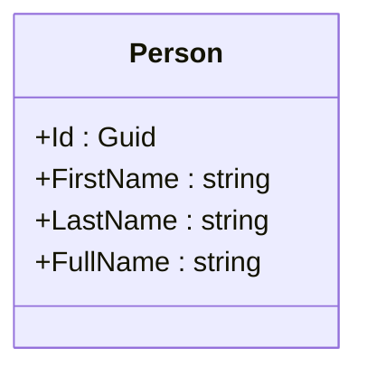
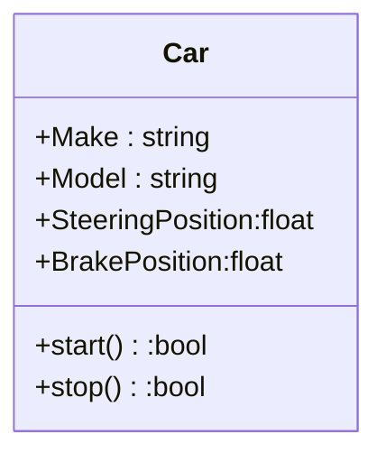

### Pillars of Object Oriented Design

- Abstraction -> Hiding Implementation 
- Encapsulation -> Data Hiding
- Inheritance -> Object Taxonomy , Code resuability 
- Polymorphism -> Object Interchangeability

### Solid Principles
- S => Single Resonsibility Principle
- O => Open - Closed Principle
- L => Liskov Substitiution Principle
- I => Interface Segregation Principle
- D => Dependency Inversion Principle

## Other terms related to Software

+ Cohesion 
+ Coupling 
+ Orthogonality 
  
# Cohesion 


    - The FullName is internally cohesive with Person Class 
    - In Classes High cohesion result in good pratices 
  
## Example of Class with Low Cohesion
  
```
using System;

public class Person
{
    public string Name { get; set; }
    public int Age { get; set; }

    public Person(string name, int age)
    {
        Name = name;
        Age = age;
    }

    public string Introduce()
    {
        return $"Hi, my name is {Name} and I am {Age} years old.";
    }

    public bool IsAdult()
    {
        return Age >= 18;
    }

    // ❌ Unrelated responsibilities (low cohesion)
    public double CalculateTax(double income)
    {
        return income * 0.2;
    }

    public void SendEmail(string message)
    {
        Console.WriteLine($"Sending email: {message}");
    }
}
```
1. CalculateTax method is completly irrelevant 


